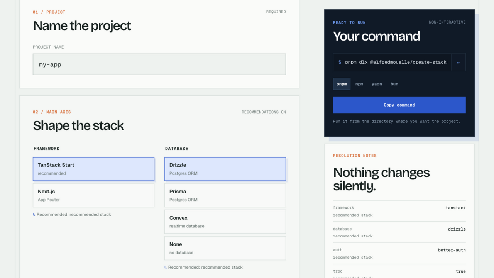

# create-stack : une vraie application, configurée selon vos choix

## Le produit

**create-stack** est une CLI npm et un constructeur web pour créer des applications full-stack. Le projet part d'une application fonctionnelle plutôt que d'un template vide. Vous choisissez sa forme, puis create-stack écrit les fichiers, branche les providers, vérifie l'environnement et lance les contrôles avant votre premier commit.

Next.js (App Router) et TanStack Start sont disponibles aujourd'hui. Le projet généré est pensé pour TypeScript, sous licence MIT et prêt à être modifié dès que la commande se termine.

## Le fonctionnement

- **Choisir la forme du projet** : framework, base de données, authentification, tRPC, mailer, monorepo et capabilities optionnelles.
- **Garder les choix explicites** : les omissions compatibles sont complétées avec une raison visible dans la CLI ou le constructeur web.
- **Commencer avec une vraie application** : routage, styles, variables d'environnement et premier écran sont déjà reliés.
- **Changer de provider sans réécrire l'application** : la base de données, l'authentification, l'email et les autres capabilities utilisent de petites interfaces, donc le remplacement reste local.
- **Transmettre un projet lisible** : create-stack retire ce que vous n'avez pas choisi, lance TypeScript et Biome, puis laisse des fichiers ordinaires que vous pouvez reprendre.

## La CLI et le constructeur web

La CLI et le constructeur utilisent la même stack recommandée. Dans le terminal, les prompts interactifs vous accompagnent dans vos choix. Les flags produisent une commande non interactive qui fonctionne aussi dans les scripts et les environnements automatisés.

Le constructeur conserve les choix dans l'URL pour partager une stack. Ses notes de résolution rendent les dépendances visibles au lieu de modifier un choix en silence. Une fois prêt, il donne la commande exacte pour pnpm, npm, yarn ou bun.

## Ce que le projet génère

- **Frameworks** : Next.js App Router ou TanStack Start.
- **Données et authentification** : Drizzle, Prisma, Convex, Better Auth, Clerk, ou aucun provider si le projet n'en a pas besoin.
- **API et email** : tRPC, puis Resend, Brevo, Amazon SES ou aucun mailer.
- **Workspace et capabilities** : application seule, Turborepo ou Nx, avec stockage objet, cache, logs structurés, analytics, jobs en arrière-plan et suivi des erreurs en option.
- **Outils** : Node.js, TypeScript, Tailwind CSS et Biome.

## Mon rôle

J'ai conçu et développé create-stack sous licence MIT. J'ai réalisé le moteur de composition, les frontières entre providers, les prompts CLI, le constructeur web et les contrôles qui rendent le projet généré prêt pour son premier commit utile.
